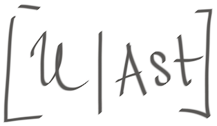

# uast2pl
  This is kind of [Universal Abstract Syntax Tree](https://doc.bblf.sh/uast/uast-specification-v2.html) to Prolog transpiler.

It takes *UAST* node as an input and tries to produce equivalent prolog program.

### Tools
- `./cmd/uast2pl -f fib.py -o fib.py.pl`.
Transforms source code into _uast_ (thanks to babelfish) and next transforms _uast_ into a prolog representation.
```bash
Usage of ./uast2pl:
  -f string
    	input file to parse
  -o string
    	output file (by default stdio)
  -s string
    	address:port of babelfish server (default "localhost:9432")
```

- `./cmd/query -f fib.py.pl -q "identifier([_, Name, [_, Start, _], _])." -v Name -v Start`.

Embedded [_wam_](https://en.wikipedia.org/wiki/Warren_Abstract_Machine) lets query prolog DB.
```bash
Usage of ./query:
  -f value
    	list of input prolog files
  -o string
    	output file (by default stdio)
  -q string
    	prolog query
  -v value
    	list of variables to print
```

### Example (extract identifiers)
For a given `fib.py` file:
```python
def fib(n, a = 0, b = 1):
    if n == 0:
        return a
    if n == 1:
        return b
    return fib(n - 1, b, a + b);
```

<details>
<summary>we get following UAST</summary>
<p>

```
{ '@type': "python:Module",
   '@role': [File, Module],
   '@pos': { '@type': "uast:Positions",
   },
   body: [
      { '@type': "uast:FunctionGroup",
         '@pos': { '@type': "uast:Positions",
            start: { '@type': "uast:Position",
               offset: 4,
               line: 1,
               col: 5,
            },
            end: { '@type': "uast:Position",
               offset: 7,
               line: 1,
               col: 8,
            },
         },
         Nodes: [
            {
               async: false,
               comments: {},
               decorators: [],
            },
            { '@type': "uast:Alias",
               Name: { '@type': "uast:Identifier",
                  Name: "fib",
               },
               Node: { '@type': "uast:Function",
                  Body: { '@type': "uast:Block",
                     Statements: [
                        { '@type': "python:If",
                           '@token': "if",
                           '@role': [Expression, If],
                           '@pos': { '@type': "uast:Positions",
                              start: { '@type': "uast:Position",
                                 offset: 30,
                                 line: 2,
                                 col: 5,
                              },
                              end: { '@type': "uast:Position",
                                 offset: 32,
                                 line: 2,
                                 col: 7,
                              },
                           },
                           body: { '@type': "python:If.body",
                              '@role': [Body, If, Then],
                              'body_stmts': [
                                 { '@type': "python:Return",
                                    '@token': "return",
                                    '@role': [Return, Statement],
                                    '@pos': { '@type': "uast:Positions",
                                       start: { '@type': "uast:Position",
                                          offset: 49,
                                          line: 3,
                                          col: 9,
                                       },
                                       end: { '@type': "uast:Position",
                                          offset: 55,
                                          line: 3,
                                          col: 15,
                                       },
                                    },
                                    value: { '@type': "python:BoxedName",
                                       '@role': [Unannotated],
                                       'boxed_value': { '@type': "uast:Identifier",
                                          '@pos': { '@type': "uast:Positions",
                                             start: { '@type': "uast:Position",
                                                offset: 56,
                                                line: 3,
                                                col: 16,
                                             },
                                             end: { '@type': "uast:Position",
                                                offset: 57,
                                                line: 3,
                                                col: 17,
                                             },
                                          },
                                          Name: "a",
                                       },
                                       ctx: "Load",
                                    },
                                 },
                              ],
                           },
                           orelse: { '@type': "python:If.orelse",
                              '@token': "else",
                              '@role': [Body, Else, If],
                              'else_stmts': [],
                           },
                           test: { '@type': "python:Compare",
                              '@role': [Binary, Condition, Expression, If],
                              '@pos': { '@type': "uast:Positions",
                                 start: { '@type': "uast:Position",
                                    offset: 33,
                                    line: 2,
                                    col: 8,
                                 },
                              },
                              comparators: { '@type': "python:Compare.comparators",
                                 '@role': [Expression, Right],
                                 comparators: [
                                    { '@type': "python:Num",
                                       '@token': 0,
                                       '@role': [Expression, Literal, Number, Primitive],
                                       '@pos': { '@type': "uast:Positions",
                                          start: { '@type': "uast:Position",
                                             offset: 38,
                                             line: 2,
                                             col: 13,
                                          },
                                          end: { '@type': "uast:Position",
                                             offset: 39,
                                             line: 2,
                                             col: 14,
                                          },
                                       },
                                    },
                                 ],
                              },
                              left: { '@type': "python:BoxedName",
                                 '@role': [Expression, Left],
                                 'boxed_value': { '@type': "uast:Identifier",
                                    '@pos': { '@type': "uast:Positions",
                                       start: { '@type': "uast:Position",
                                          offset: 33,
                                          line: 2,
                                          col: 8,
                                       },
                                       end: { '@type': "uast:Position",
                                          offset: 34,
                                          line: 2,
                                          col: 9,
                                       },
                                    },
                                    Name: "n",
                                 },
                                 ctx: "Load",
                              },
                              ops: { '@type': "python:Compare.ops",
                                 '@role': [Expression],
                                 ops: [
                                    { '@type': "python:Eq",
                                       '@token': "==",
                                       '@role': [Equal, Operator, Relational],
                                       '@pos': { '@type': "uast:Positions",
                                       },
                                    },
                                 ],
                              },
                           },
                        },
                        { '@type': "python:If",
                           '@token': "if",
                           '@role': [Expression, If],
                           '@pos': { '@type': "uast:Positions",
                              start: { '@type': "uast:Position",
                                 offset: 62,
                                 line: 4,
                                 col: 5,
                              },
                              end: { '@type': "uast:Position",
                                 offset: 64,
                                 line: 4,
                                 col: 7,
                              },
                           },
                           body: { '@type': "python:If.body",
                              '@role': [Body, If, Then],
                              'body_stmts': [
                                 { '@type': "python:Return",
                                    '@token': "return",
                                    '@role': [Return, Statement],
                                    '@pos': { '@type': "uast:Positions",
                                       start: { '@type': "uast:Position",
                                          offset: 81,
                                          line: 5,
                                          col: 9,
                                       },
                                       end: { '@type': "uast:Position",
                                          offset: 87,
                                          line: 5,
                                          col: 15,
                                       },
                                    },
                                    value: { '@type': "python:BoxedName",
                                       '@role': [Unannotated],
                                       'boxed_value': { '@type': "uast:Identifier",
                                          '@pos': { '@type': "uast:Positions",
                                             start: { '@type': "uast:Position",
                                                offset: 88,
                                                line: 5,
                                                col: 16,
                                             },
                                             end: { '@type': "uast:Position",
                                                offset: 89,
                                                line: 5,
                                                col: 17,
                                             },
                                          },
                                          Name: "b",
                                       },
                                       ctx: "Load",
                                    },
                                 },
                              ],
                           },
                           orelse: { '@type': "python:If.orelse",
                              '@token': "else",
                              '@role': [Body, Else, If],
                              'else_stmts': [],
                           },
                           test: { '@type': "python:Compare",
                              '@role': [Binary, Condition, Expression, If],
                              '@pos': { '@type': "uast:Positions",
                                 start: { '@type': "uast:Position",
                                    offset: 65,
                                    line: 4,
                                    col: 8,
                                 },
                              },
                              comparators: { '@type': "python:Compare.comparators",
                                 '@role': [Expression, Right],
                                 comparators: [
                                    { '@type': "python:Num",
                                       '@token': 1,
                                       '@role': [Expression, Literal, Number, Primitive],
                                       '@pos': { '@type': "uast:Positions",
                                          start: { '@type': "uast:Position",
                                             offset: 70,
                                             line: 4,
                                             col: 13,
                                          },
                                          end: { '@type': "uast:Position",
                                             offset: 71,
                                             line: 4,
                                             col: 14,
                                          },
                                       },
                                    },
                                 ],
                              },
                              left: { '@type': "python:BoxedName",
                                 '@role': [Expression, Left],
                                 'boxed_value': { '@type': "uast:Identifier",
                                    '@pos': { '@type': "uast:Positions",
                                       start: { '@type': "uast:Position",
                                          offset: 65,
                                          line: 4,
                                          col: 8,
                                       },
                                       end: { '@type': "uast:Position",
                                          offset: 66,
                                          line: 4,
                                          col: 9,
                                       },
                                    },
                                    Name: "n",
                                 },
                                 ctx: "Load",
                              },
                              ops: { '@type': "python:Compare.ops",
                                 '@role': [Expression],
                                 ops: [
                                    { '@type': "python:Eq",
                                       '@token': "==",
                                       '@role': [Equal, Operator, Relational],
                                       '@pos': { '@type': "uast:Positions",
                                       },
                                    },
                                 ],
                              },
                           },
                        },
                        { '@type': "python:Return",
                           '@token': "return",
                           '@role': [Return, Statement],
                           '@pos': { '@type': "uast:Positions",
                              start: { '@type': "uast:Position",
                                 offset: 94,
                                 line: 6,
                                 col: 5,
                              },
                              end: { '@type': "uast:Position",
                                 offset: 100,
                                 line: 6,
                                 col: 11,
                              },
                           },
                           value: { '@type': "python:Call",
                              '@role': [Call, Expression, Function],
                              '@pos': { '@type': "uast:Positions",
                                 start: { '@type': "uast:Position",
                                    offset: 101,
                                    line: 6,
                                    col: 12,
                                 },
                              },
                              args: [
                                 { '@type': "python:BinOp",
                                    '@role': [Argument, Binary, Call, Expression, Function, Name, Positional],
                                    '@pos': { '@type': "uast:Positions",
                                       start: { '@type': "uast:Position",
                                          offset: 105,
                                          line: 6,
                                          col: 16,
                                       },
                                    },
                                    left: { '@type': "python:BoxedName",
                                       '@role': [Binary, Expression, Left],
                                       'boxed_value': { '@type': "uast:Identifier",
                                          '@pos': { '@type': "uast:Positions",
                                             start: { '@type': "uast:Position",
                                                offset: 105,
                                                line: 6,
                                                col: 16,
                                             },
                                             end: { '@type': "uast:Position",
                                                offset: 106,
                                                line: 6,
                                                col: 17,
                                             },
                                          },
                                          Name: "n",
                                       },
                                       ctx: "Load",
                                    },
                                    op: { '@type': "python:Sub",
                                       '@token': "-",
                                       '@role': [Arithmetic, Binary, Operator, Substract],
                                       '@pos': { '@type': "uast:Positions",
                                       },
                                    },
                                    right: { '@type': "python:Num",
                                       '@token': 1,
                                       '@role': [Binary, Expression, Literal, Number, Primitive, Right],
                                       '@pos': { '@type': "uast:Positions",
                                          start: { '@type': "uast:Position",
                                             offset: 109,
                                             line: 6,
                                             col: 20,
                                          },
                                          end: { '@type': "uast:Position",
                                             offset: 110,
                                             line: 6,
                                             col: 21,
                                          },
                                       },
                                    },
                                 },
                                 { '@type': "python:BoxedName",
                                    '@role': [Argument, Call, Function, Name, Positional],
                                    'boxed_value': { '@type': "uast:Identifier",
                                       '@pos': { '@type': "uast:Positions",
                                          start: { '@type': "uast:Position",
                                             offset: 112,
                                             line: 6,
                                             col: 23,
                                          },
                                          end: { '@type': "uast:Position",
                                             offset: 113,
                                             line: 6,
                                             col: 24,
                                          },
                                       },
                                       Name: "b",
                                    },
                                    ctx: "Load",
                                 },
                                 { '@type': "python:BinOp",
                                    '@role': [Argument, Binary, Call, Expression, Function, Name, Positional],
                                    '@pos': { '@type': "uast:Positions",
                                       start: { '@type': "uast:Position",
                                          offset: 115,
                                          line: 6,
                                          col: 26,
                                       },
                                    },
                                    left: { '@type': "python:BoxedName",
                                       '@role': [Binary, Expression, Left],
                                       'boxed_value': { '@type': "uast:Identifier",
                                          '@pos': { '@type': "uast:Positions",
                                             start: { '@type': "uast:Position",
                                                offset: 115,
                                                line: 6,
                                                col: 26,
                                             },
                                             end: { '@type': "uast:Position",
                                                offset: 116,
                                                line: 6,
                                                col: 27,
                                             },
                                          },
                                          Name: "a",
                                       },
                                       ctx: "Load",
                                    },
                                    op: { '@type': "python:Add",
                                       '@token': "+",
                                       '@role': [Add, Arithmetic, Binary, Operator],
                                       '@pos': { '@type': "uast:Positions",
                                       },
                                    },
                                    right: { '@type': "python:BoxedName",
                                       '@role': [Binary, Expression, Right],
                                       'boxed_value': { '@type': "uast:Identifier",
                                          '@pos': { '@type': "uast:Positions",
                                             start: { '@type': "uast:Position",
                                                offset: 119,
                                                line: 6,
                                                col: 30,
                                             },
                                             end: { '@type': "uast:Position",
                                                offset: 120,
                                                line: 6,
                                                col: 31,
                                             },
                                          },
                                          Name: "b",
                                       },
                                       ctx: "Load",
                                    },
                                 },
                              ],
                              func: { '@type': "python:BoxedName",
                                 '@role': [Call, Callee],
                                 'boxed_value': { '@type': "uast:Identifier",
                                    '@pos': { '@type': "uast:Positions",
                                       start: { '@type': "uast:Position",
                                          offset: 101,
                                          line: 6,
                                          col: 12,
                                       },
                                       end: { '@type': "uast:Position",
                                          offset: 104,
                                          line: 6,
                                          col: 15,
                                       },
                                    },
                                    Name: "fib",
                                 },
                                 ctx: "Load",
                              },
                              keywords: [],
                           },
                        },
                     ],
                  },
                  Type: { '@type': "uast:FunctionType",
                     Arguments: [
                        { '@type': "uast:Argument",
                           '@pos': { '@type': "uast:Positions",
                              start: { '@type': "uast:Position",
                                 offset: 8,
                                 line: 1,
                                 col: 9,
                              },
                              end: { '@type': "uast:Position",
                                 offset: 9,
                                 line: 1,
                                 col: 10,
                              },
                           },
                           MapVariadic: false,
                           Name: { '@type': "uast:Identifier",
                              '@pos': { '@type': "uast:Positions",
                                 start: { '@type': "uast:Position",
                                    offset: 8,
                                    line: 1,
                                    col: 9,
                                 },
                                 end: { '@type': "uast:Position",
                                    offset: 9,
                                    line: 1,
                                    col: 10,
                                 },
                              },
                              Name: "n",
                           },
                           Receiver: false,
                           Type: ~,
                           Variadic: false,
                        },
                        { '@type': "uast:Argument",
                           '@pos': { '@type': "uast:Positions",
                              start: { '@type': "uast:Position",
                                 offset: 11,
                                 line: 1,
                                 col: 12,
                              },
                              end: { '@type': "uast:Position",
                                 offset: 12,
                                 line: 1,
                                 col: 13,
                              },
                           },
                           Init: { '@type': "python:Num",
                              '@token': 0,
                              '@role': [Expression, Literal, Number, Primitive],
                              '@pos': { '@type': "uast:Positions",
                                 start: { '@type': "uast:Position",
                                    offset: 15,
                                    line: 1,
                                    col: 16,
                                 },
                                 end: { '@type': "uast:Position",
                                    offset: 16,
                                    line: 1,
                                    col: 17,
                                 },
                              },
                           },
                           MapVariadic: false,
                           Name: { '@type': "uast:Identifier",
                              '@pos': { '@type': "uast:Positions",
                                 start: { '@type': "uast:Position",
                                    offset: 11,
                                    line: 1,
                                    col: 12,
                                 },
                                 end: { '@type': "uast:Position",
                                    offset: 12,
                                    line: 1,
                                    col: 13,
                                 },
                              },
                              Name: "a",
                           },
                           Receiver: false,
                           Type: ~,
                           Variadic: false,
                        },
                        { '@type': "uast:Argument",
                           '@pos': { '@type': "uast:Positions",
                              start: { '@type': "uast:Position",
                                 offset: 18,
                                 line: 1,
                                 col: 19,
                              },
                              end: { '@type': "uast:Position",
                                 offset: 19,
                                 line: 1,
                                 col: 20,
                              },
                           },
                           Init: { '@type': "python:Num",
                              '@token': 1,
                              '@role': [Expression, Literal, Number, Primitive],
                              '@pos': { '@type': "uast:Positions",
                                 start: { '@type': "uast:Position",
                                    offset: 22,
                                    line: 1,
                                    col: 23,
                                 },
                                 end: { '@type': "uast:Position",
                                    offset: 23,
                                    line: 1,
                                    col: 24,
                                 },
                              },
                           },
                           MapVariadic: false,
                           Name: { '@type': "uast:Identifier",
                              '@pos': { '@type': "uast:Positions",
                                 start: { '@type': "uast:Position",
                                    offset: 18,
                                    line: 1,
                                    col: 19,
                                 },
                                 end: { '@type': "uast:Position",
                                    offset: 19,
                                    line: 1,
                                    col: 20,
                                 },
                              },
                              Name: "b",
                           },
                           Receiver: false,
                           Type: ~,
                           Variadic: false,
                        },
                     ],
                     Returns: [
                        { '@type': "uast:Argument",
                           Init: { '@type': "uast:Identifier",
                              Name: "None",
                           },
                           MapVariadic: false,
                           Name: ~,
                           Receiver: false,
                           Type: ~,
                           Variadic: false,
                        },
                     ],
                  },
               },
            },
         ],
      },
   ],
}
```

</p>
</details>

<details>
<summary>what can be transformed into a prolog program</summary>
<p>

```prolog
positions0(['uast:Positions', _, _]).
value0('File').
value1('Module').
array0([Arg0,Arg1]) :- value0(Arg0),value1(Arg1).
value2('python:Module').
position0(['uast:Position', 5, 1, 4]).
position1(['uast:Position', 8, 1, 7]).
positions1(['uast:Positions', Start, End]) :- position0(Start), position1(End).
array1([]).
value3(false).
object0(_).
object1(Obj) :- !,array1(Obj);value3(Obj);object0(Obj).
positions2(['uast:Positions', _, _]).
positions3(['uast:Positions', _, _]).
position2(['uast:Position', 9, 1, 8]).
position3(['uast:Position', 10, 1, 9]).
positions4(['uast:Positions', Start, End]) :- position2(Start), position3(End).
role0('Identifier').
identifier0(['uast:Identifier', 'n', Pos, [Role0]]) :- positions4(Pos),role0(Role0).
positions5(['uast:Positions', Start, End]) :- position2(Start), position3(End).
argument0(['uast:Argument', Name, _, _, false, false, false, Pos]) :- identifier0(Name),positions5(Pos).
position4(['uast:Position', 12, 1, 11]).
position5(['uast:Position', 13, 1, 12]).
positions6(['uast:Positions', Start, End]) :- position4(Start), position5(End).
identifier1(['uast:Identifier', 'a', Pos, [Role0]]) :- positions6(Pos),role0(Role0).
value4('Expression').
value5('Literal').
value6('Number').
value7('Primitive').
array2([Arg0,Arg1,Arg2,Arg3]) :- value4(Arg0),value5(Arg1),value6(Arg2),value7(Arg3).
value8('python:Num').
value9(0).
position6(['uast:Position', 16, 1, 15]).
position7(['uast:Position', 17, 1, 16]).
positions7(['uast:Positions', Start, End]) :- position6(Start), position7(End).
object2(Obj) :- !,array2(Obj);value8(Obj);value9(Obj);positions7(Obj).
positions8(['uast:Positions', Start, End]) :- position4(Start), position5(End).
argument1(['uast:Argument', Name, _, Init, false, false, false, Pos]) :- identifier1(Name),object2(Init),positions8(Pos).
position8(['uast:Position', 19, 1, 18]).
position9(['uast:Position', 20, 1, 19]).
positions9(['uast:Positions', Start, End]) :- position8(Start), position9(End).
identifier2(['uast:Identifier', 'b', Pos, [Role0]]) :- positions9(Pos),role0(Role0).
position10(['uast:Position', 23, 1, 22]).
position11(['uast:Position', 24, 1, 23]).
positions10(['uast:Positions', Start, End]) :- position10(Start), position11(End).
array3([Arg0,Arg1,Arg2,Arg3]) :- value4(Arg0),value5(Arg1),value6(Arg2),value7(Arg3).
value10(1).
object3(Obj) :- !,positions10(Obj);array3(Obj);value8(Obj);value10(Obj).
positions11(['uast:Positions', Start, End]) :- position8(Start), position9(End).
argument2(['uast:Argument', Name, _, Init, false, false, false, Pos]) :- identifier2(Name),object3(Init),positions11(Pos).
positions12(['uast:Positions', _, _]).
identifier3(['uast:Identifier', 'None', Pos, [Role0]]) :- positions12(Pos),role0(Role0).
positions13(['uast:Positions', _, _]).
argument3(['uast:Argument', _, _, Init, false, false, false, Pos]) :- identifier3(Init),positions13(Pos).
function_type0(['uast:FunctionType', [Arg0,Arg1,Arg2], [Ret0], Pos]) :- argument0(Arg0),argument1(Arg1),argument2(Arg2),argument3(Ret0),positions3(Pos).
positions14(['uast:Positions', _, _]).
value11('python:If.orelse').
value12('else').
array4([]).
value13('If').
value14('Body').
value15('Else').
array5([Arg0,Arg1,Arg2]) :- value13(Arg0),value14(Arg1),value15(Arg2).
object4(Obj) :- !,value11(Obj);value12(Obj);array4(Obj);array5(Obj).
value16('python:Compare').
value17('Right').
array6([Arg0,Arg1]) :- value4(Arg0),value17(Arg1).
value18('python:Compare.comparators').
position12(['uast:Position', 13, 2, 38]).
position13(['uast:Position', 14, 2, 39]).
positions15(['uast:Positions', Start, End]) :- position12(Start), position13(End).
array7([Arg0,Arg1,Arg2,Arg3]) :- value4(Arg0),value5(Arg1),value6(Arg2),value7(Arg3).
object5(Obj) :- !,value8(Obj);value9(Obj);positions15(Obj);array7(Obj).
array8([Arg0]) :- object5(Arg0).
object6(Obj) :- !,array6(Obj);value18(Obj);array8(Obj).
value19('python:BoxedName').
position14(['uast:Position', 8, 2, 33]).
position15(['uast:Position', 9, 2, 34]).
positions16(['uast:Positions', Start, End]) :- position14(Start), position15(End).
identifier4(['uast:Identifier', 'n', Pos, [Role0]]) :- positions16(Pos),role0(Role0).
value20('Load').
value21('Left').
array9([Arg0,Arg1]) :- value4(Arg0),value21(Arg1).
object7(Obj) :- !,value19(Obj);identifier4(Obj);value20(Obj);array9(Obj).
array10([Arg0]) :- value4(Arg0).
value22('python:Compare.ops').
positions17(['uast:Positions', _, _]).
value23('Operator').
value24('Relational').
value25('Equal').
array11([Arg0,Arg1,Arg2]) :- value23(Arg0),value24(Arg1),value25(Arg2).
value26('python:Eq').
value27('==').
object8(Obj) :- !,positions17(Obj);array11(Obj);value26(Obj);value27(Obj).
array12([Arg0]) :- object8(Arg0).
object9(Obj) :- !,array10(Obj);value22(Obj);array12(Obj).
positions18(['uast:Positions', Start, _]) :- position14(Start).
value28('Binary').
value29('Condition').
array13([Arg0,Arg1,Arg2,Arg3]) :- value4(Arg0),value28(Arg1),value29(Arg2),value13(Arg3).
object10(Obj) :- !,value16(Obj);object6(Obj);object7(Obj);object9(Obj);positions18(Obj);array13(Obj).
position16(['uast:Position', 5, 2, 30]).
position17(['uast:Position', 7, 2, 32]).
positions19(['uast:Positions', Start, End]) :- position16(Start), position17(End).
array14([Arg0,Arg1]) :- value13(Arg0),value4(Arg1).
value30('python:If').
value31('Then').
array15([Arg0,Arg1,Arg2]) :- value13(Arg0),value14(Arg1),value31(Arg2).
value32('python:If.body').
position18(['uast:Position', 9, 3, 49]).
position19(['uast:Position', 15, 3, 55]).
positions20(['uast:Positions', Start, End]) :- position18(Start), position19(End).
value33('Return').
value34('Statement').
array16([Arg0,Arg1]) :- value33(Arg0),value34(Arg1).
value35('python:Return').
value36('return').
position20(['uast:Position', 16, 3, 56]).
position21(['uast:Position', 17, 3, 57]).
positions21(['uast:Positions', Start, End]) :- position20(Start), position21(End).
identifier5(['uast:Identifier', 'a', Pos, [Role0]]) :- positions21(Pos),role0(Role0).
object11(Obj) :- !,value19(Obj);identifier5(Obj);value20(Obj).
object12(Obj) :- !,positions20(Obj);array16(Obj);value35(Obj);value36(Obj);object11(Obj).
array17([Arg0]) :- object12(Arg0).
object13(Obj) :- !,array15(Obj);value32(Obj);array17(Obj).
value37('if').
object14(Obj) :- !,object4(Obj);object10(Obj);positions19(Obj);array14(Obj);value30(Obj);object13(Obj);value37(Obj).
array18([Arg0,Arg1]) :- value13(Arg0),value4(Arg1).
array19([Arg0,Arg1,Arg2]) :- value13(Arg0),value14(Arg1),value31(Arg2).
position22(['uast:Position', 16, 5, 88]).
position23(['uast:Position', 17, 5, 89]).
positions22(['uast:Positions', Start, End]) :- position22(Start), position23(End).
identifier6(['uast:Identifier', 'b', Pos, [Role0]]) :- positions22(Pos),role0(Role0).
object15(Obj) :- !,value19(Obj);identifier6(Obj);value20(Obj).
position24(['uast:Position', 9, 5, 81]).
position25(['uast:Position', 15, 5, 87]).
positions23(['uast:Positions', Start, End]) :- position24(Start), position25(End).
array20([Arg0,Arg1]) :- value33(Arg0),value34(Arg1).
object16(Obj) :- !,object15(Obj);positions23(Obj);array20(Obj);value35(Obj);value36(Obj).
array21([Arg0]) :- object16(Arg0).
object17(Obj) :- !,array19(Obj);value32(Obj);array21(Obj).
array22([Arg0,Arg1,Arg2]) :- value13(Arg0),value14(Arg1),value15(Arg2).
array23([]).
object18(Obj) :- !,array22(Obj);value11(Obj);value12(Obj);array23(Obj).
array24([Arg0,Arg1]) :- value4(Arg0),value17(Arg1).
position26(['uast:Position', 13, 4, 70]).
position27(['uast:Position', 14, 4, 71]).
positions24(['uast:Positions', Start, End]) :- position26(Start), position27(End).
array25([Arg0,Arg1,Arg2,Arg3]) :- value4(Arg0),value5(Arg1),value6(Arg2),value7(Arg3).
object19(Obj) :- !,positions24(Obj);array25(Obj);value8(Obj);value10(Obj).
array26([Arg0]) :- object19(Arg0).
object20(Obj) :- !,array24(Obj);value18(Obj);array26(Obj).
position28(['uast:Position', 8, 4, 65]).
position29(['uast:Position', 9, 4, 66]).
positions25(['uast:Positions', Start, End]) :- position28(Start), position29(End).
identifier7(['uast:Identifier', 'n', Pos, [Role0]]) :- positions25(Pos),role0(Role0).
array27([Arg0,Arg1]) :- value4(Arg0),value21(Arg1).
object21(Obj) :- !,identifier7(Obj);value20(Obj);array27(Obj);value19(Obj).
array28([Arg0]) :- value4(Arg0).
positions26(['uast:Positions', _, _]).
array29([Arg0,Arg1,Arg2]) :- value23(Arg0),value24(Arg1),value25(Arg2).
object22(Obj) :- !,positions26(Obj);array29(Obj);value26(Obj);value27(Obj).
array30([Arg0]) :- object22(Arg0).
object23(Obj) :- !,array28(Obj);value22(Obj);array30(Obj).
positions27(['uast:Positions', Start, _]) :- position28(Start).
array31([Arg0,Arg1,Arg2,Arg3]) :- value4(Arg0),value28(Arg1),value29(Arg2),value13(Arg3).
object24(Obj) :- !,value16(Obj);object20(Obj);object21(Obj);object23(Obj);positions27(Obj);array31(Obj).
position30(['uast:Position', 5, 4, 62]).
position31(['uast:Position', 7, 4, 64]).
positions28(['uast:Positions', Start, End]) :- position30(Start), position31(End).
object25(Obj) :- !,array18(Obj);value30(Obj);object17(Obj);value37(Obj);object18(Obj);object24(Obj);positions28(Obj).
position32(['uast:Position', 5, 6, 94]).
position33(['uast:Position', 11, 6, 100]).
positions29(['uast:Positions', Start, End]) :- position32(Start), position33(End).
array32([Arg0,Arg1]) :- value33(Arg0),value34(Arg1).
value38('Arithmetic').
value39('Substract').
array33([Arg0,Arg1,Arg2,Arg3]) :- value23(Arg0),value38(Arg1),value39(Arg2),value28(Arg3).
value40('python:Sub').
value41('-').
positions30(['uast:Positions', _, _]).
object26(Obj) :- !,array33(Obj);value40(Obj);value41(Obj);positions30(Obj).
position34(['uast:Position', 20, 6, 109]).
position35(['uast:Position', 21, 6, 110]).
positions31(['uast:Positions', Start, End]) :- position34(Start), position35(End).
array34([Arg0,Arg1,Arg2,Arg3,Arg4,Arg5]) :- value4(Arg0),value5(Arg1),value6(Arg2),value7(Arg3),value28(Arg4),value17(Arg5).
object27(Obj) :- !,positions31(Obj);array34(Obj);value8(Obj);value10(Obj).
position36(['uast:Position', 16, 6, 105]).
positions32(['uast:Positions', Start, _]) :- position36(Start).
value42('Function').
value43('Call').
value44('Positional').
value45('Argument').
value46('Name').
array35([Arg0,Arg1,Arg2,Arg3,Arg4,Arg5,Arg6]) :- value4(Arg0),value28(Arg1),value42(Arg2),value43(Arg3),value44(Arg4),value45(Arg5),value46(Arg6).
value47('python:BinOp').
array36([Arg0,Arg1,Arg2]) :- value4(Arg0),value28(Arg1),value21(Arg2).
position37(['uast:Position', 17, 6, 106]).
positions33(['uast:Positions', Start, End]) :- position36(Start), position37(End).
identifier8(['uast:Identifier', 'n', Pos, [Role0]]) :- positions33(Pos),role0(Role0).
object28(Obj) :- !,array36(Obj);value19(Obj);identifier8(Obj);value20(Obj).
object29(Obj) :- !,object26(Obj);object27(Obj);positions32(Obj);array35(Obj);value47(Obj);object28(Obj).
array37([Arg0,Arg1,Arg2,Arg3,Arg4]) :- value42(Arg0),value43(Arg1),value44(Arg2),value45(Arg3),value46(Arg4).
position38(['uast:Position', 23, 6, 112]).
position39(['uast:Position', 24, 6, 113]).
positions34(['uast:Positions', Start, End]) :- position38(Start), position39(End).
identifier9(['uast:Identifier', 'b', Pos, [Role0]]) :- positions34(Pos),role0(Role0).
object30(Obj) :- !,value20(Obj);array37(Obj);value19(Obj);identifier9(Obj).
array38([Arg0,Arg1,Arg2]) :- value4(Arg0),value28(Arg1),value17(Arg2).
position40(['uast:Position', 30, 6, 119]).
position41(['uast:Position', 31, 6, 120]).
positions35(['uast:Positions', Start, End]) :- position40(Start), position41(End).
identifier10(['uast:Identifier', 'b', Pos, [Role0]]) :- positions35(Pos),role0(Role0).
object31(Obj) :- !,value20(Obj);array38(Obj);value19(Obj);identifier10(Obj).
position42(['uast:Position', 26, 6, 115]).
positions36(['uast:Positions', Start, _]) :- position42(Start).
array39([Arg0,Arg1,Arg2,Arg3,Arg4,Arg5,Arg6]) :- value4(Arg0),value28(Arg1),value42(Arg2),value43(Arg3),value44(Arg4),value45(Arg5),value46(Arg6).
array40([Arg0,Arg1,Arg2]) :- value4(Arg0),value28(Arg1),value21(Arg2).
position43(['uast:Position', 27, 6, 116]).
positions37(['uast:Positions', Start, End]) :- position42(Start), position43(End).
identifier11(['uast:Identifier', 'a', Pos, [Role0]]) :- positions37(Pos),role0(Role0).
object32(Obj) :- !,array40(Obj);value19(Obj);identifier11(Obj);value20(Obj).
positions38(['uast:Positions', _, _]).
value48('Add').
array41([Arg0,Arg1,Arg2,Arg3]) :- value23(Arg0),value38(Arg1),value48(Arg2),value28(Arg3).
value49('python:Add').
value50('+').
object33(Obj) :- !,positions38(Obj);array41(Obj);value49(Obj);value50(Obj).
object34(Obj) :- !,object31(Obj);positions36(Obj);array39(Obj);value47(Obj);object32(Obj);object33(Obj).
array42([Arg0,Arg1,Arg2]) :- object29(Arg0),object30(Arg1),object34(Arg2).
value51('Callee').
array43([Arg0,Arg1]) :- value43(Arg0),value51(Arg1).
position44(['uast:Position', 12, 6, 101]).
position45(['uast:Position', 15, 6, 104]).
positions39(['uast:Positions', Start, End]) :- position44(Start), position45(End).
identifier12(['uast:Identifier', 'fib', Pos, [Role0]]) :- positions39(Pos),role0(Role0).
object35(Obj) :- !,value20(Obj);array43(Obj);value19(Obj);identifier12(Obj).
array44([]).
positions40(['uast:Positions', Start, _]) :- position44(Start).
array45([Arg0,Arg1,Arg2]) :- value42(Arg0),value43(Arg1),value4(Arg2).
value52('python:Call').
object36(Obj) :- !,array42(Obj);object35(Obj);array44(Obj);positions40(Obj);array45(Obj);value52(Obj).
object37(Obj) :- !,positions29(Obj);array32(Obj);value35(Obj);value36(Obj);object36(Obj).
block0(['uast:Block', [Stmt0,Stmt1,Stmt2], Pos]) :- positions14(Pos),object14(Stmt0),object25(Stmt1),object37(Stmt2).
positions41(['uast:Positions', _, _]).
function0(['uast:Function', FnType, Body, Pos]) :- function_type0(FnType),block0(Body),positions41(Pos).
positions42(['uast:Positions', _, _]).
identifier13(['uast:Identifier', 'fib', Pos, [Role0]]) :- positions42(Pos),role0(Role0).
alias0(['uast:Alias', Name, Node, Pos]) :- identifier13(Name),function0(Node),positions2(Pos).
function_group0(['uast:FunctionGroup', [Node0,Node1], Pos]) :- positions1(Pos),object1(Node0),alias0(Node1).
array46([Arg0]) :- function_group0(Arg0).
object38(Obj) :- !,positions0(Obj);array0(Obj);value2(Obj);array46(Obj).

% value(Val).
value(X) :- value0(X);value1(X);value2(X);value3(X);value4(X);value5(X);value6(X);value7(X);value8(X);value9(X);value10(X);value11(X);value12(X);value13(X);value14(X);value15(X);value16(X);value17(X);value18(X);value19(X);value20(X);value21(X);value22(X);value23(X);value24(X);value25(X);value26(X);value27(X);value28(X);value29(X);value30(X);value31(X);value32(X);value33(X);value34(X);value35(X);value36(X);value37(X);value38(X);value39(X);value40(X);value41(X);value42(X);value43(X);value44(X);value45(X);value46(X);value47(X);value48(X);value49(X);value50(X);value51(X);value52(X).

% array([Arguments]).
array(X) :- array0(X);array1(X);array2(X);array3(X);array4(X);array5(X);array6(X);array7(X);array8(X);array9(X);array10(X);array11(X);array12(X);array13(X);array14(X);array15(X);array16(X);array17(X);array18(X);array19(X);array20(X);array21(X);array22(X);array23(X);array24(X);array25(X);array26(X);array27(X);array28(X);array29(X);array30(X);array31(X);array32(X);array33(X);array34(X);array35(X);array36(X);array37(X);array38(X);array39(X);array40(X);array41(X);array42(X);array43(X);array44(X);array45(X);array46(X).

% object(Obj).
object(X) :- object0(X);object1(X);object2(X);object3(X);object4(X);object5(X);object6(X);object7(X);object8(X);object9(X);object10(X);object11(X);object12(X);object13(X);object14(X);object15(X);object16(X);object17(X);object18(X);object19(X);object20(X);object21(X);object22(X);object23(X);object24(X);object25(X);object26(X);object27(X);object28(X);object29(X);object30(X);object31(X);object32(X);object33(X);object34(X);object35(X);object36(X);object37(X);object38(X).

% role(Name).
role(X) :- role0(X).

% position([Type, Col, Line, Offset]).
position(X) :- position0(X);position1(X);position2(X);position3(X);position4(X);position5(X);position6(X);position7(X);position8(X);position9(X);position10(X);position11(X);position12(X);position13(X);position14(X);position15(X);position16(X);position17(X);position18(X);position19(X);position20(X);position21(X);position22(X);position23(X);position24(X);position25(X);position26(X);position27(X);position28(X);position29(X);position30(X);position31(X);position32(X);position33(X);position34(X);position35(X);position36(X);position37(X);position38(X);position39(X);position40(X);position41(X);position42(X);position43(X);position44(X);position45(X).

% positions([Type, Start, End]).
positions(X) :- positions0(X);positions1(X);positions2(X);positions3(X);positions4(X);positions5(X);positions6(X);positions7(X);positions8(X);positions9(X);positions10(X);positions11(X);positions12(X);positions13(X);positions14(X);positions15(X);positions16(X);positions17(X);positions18(X);positions19(X);positions20(X);positions21(X);positions22(X);positions23(X);positions24(X);positions25(X);positions26(X);positions27(X);positions28(X);positions29(X);positions30(X);positions31(X);positions32(X);positions33(X);positions34(X);positions35(X);positions36(X);positions37(X);positions38(X);positions39(X);positions40(X);positions41(X);positions42(X).

% identifier([Type, Name, Pos, [Roles]]).
identifier(X) :- identifier0(X);identifier1(X);identifier2(X);identifier3(X);identifier4(X);identifier5(X);identifier6(X);identifier7(X);identifier8(X);identifier9(X);identifier10(X);identifier11(X);identifier12(X);identifier13(X).

% qualified_identifier([Type, [Names], Pos]).
qualified_identifier(_) :- fail.

% comment([Type, Prefix, Suffix, Tab, Text, Block, Pos]).
comment(_) :- fail.

% group([Type, [Nodes], Pos]).
group(_) :- fail.

% function_group([Type, [Nodes], Pos]).
function_group(X) :- function_group0(X).

% block([Type, [Statements], Pos]).
block(X) :- block0(X).

% alias([Type, Name, Node, Pos]).
alias(X) :- alias0(X).

% import([Type, Path, Pos]).
import(_) :- fail.

% runtime_import([Type, Path, Pos]).
runtime_import(_) :- fail.

% runtime_reimport([Type, Path, Pos]).
runtime_reimport(_) :- fail.

% inline_import([Type, Path, Pos]).
inline_import(_) :- fail.

% argument([Type, Name, ArgType, Init, Variadic, MapVariadic, Receiver, Pos]).
argument(X) :- argument0(X);argument1(X);argument2(X);argument3(X).

% function_type([Type, [Arguments], [Returns], Pos]).
function_type(X) :- function_type0(X).

% function([Type, FuncType, Body, Pos]).
function(X) :- function0(X).
```

</p>
</details>

Next, we can query DB to get all identifiers and start positions (we can also use any other prolog implementation, e.g. [swi-prolog](https://www.swi-prolog.org)):
```bash
./query -f fib.py.pl -q "identifier([_, Name, [_, Start, _], _])." -v Name -v Start

Name = n
Start = ['uast:Position',16,6,105]

Name = b
Start = ['uast:Position',23,6,112]

Name = a
Start = ['uast:Position',26,6,115]

Name = b
Start = ['uast:Position',30,6,119]

Name = fib
Start = ['uast:Position',12,6,101]
...
```


### Example (extract import paths)
For a given `hello.java` file:
```java
// hello.java
import java.io.*;
import javax.servlet.*;

public class Hello extends GenericServlet {
    public void service(final ServletRequest request, final ServletResponse response)
    throws ServletException, IOException {
        response.setContentType("text/html");
        final PrintWriter pw = response.getWriter();
        try {
            pw.println("Hello, world!");
        } finally {
            pw.close();
        }
    }
}
```

<details>
<summary>we get following UAST</summary>
<p>

```
{ '@type': "java:CompilationUnit",
   '@role': [File],
   '@pos': { '@type': "uast:Positions",
      start: { '@type': "uast:Position",
         offset: 0,
         line: 1,
         col: 1,
      },
      end: { '@type': "uast:Position",
         offset: 448,
         line: 19,
         col: 1,
      },
   },
   comments: [
      { '@type': "uast:Comment",
         '@pos': { '@type': "uast:Positions",
            start: { '@type': "uast:Position",
               offset: 0,
               line: 1,
               col: 1,
            },
            end: { '@type': "uast:Position",
               offset: 13,
               line: 1,
               col: 14,
            },
         },
         Block: false,
         Prefix: " ",
         Suffix: "",
         Tab: "",
         Text: "hello.java",
      },
   ],
   imports: [
      { '@type': "uast:Import",
         '@pos': { '@type': "uast:Positions",
            start: { '@type': "uast:Position",
               offset: 14,
               line: 2,
               col: 1,
            },
            end: { '@type': "uast:Position",
               offset: 31,
               line: 2,
               col: 18,
            },
         },
         All: true,
         Names: [],
         Path: { '@type': "uast:QualifiedIdentifier",
            '@pos': { '@type': "uast:Positions",
               start: { '@type': "uast:Position",
                  offset: 21,
                  line: 2,
                  col: 8,
               },
               end: { '@type': "uast:Position",
                  offset: 28,
                  line: 2,
                  col: 15,
               },
            },
            Names: [
               { '@type': "uast:Identifier",
                  '@pos': { '@type': "uast:Positions",
                     start: { '@type': "uast:Position",
                        offset: 21,
                        line: 2,
                        col: 8,
                     },
                     end: { '@type': "uast:Position",
                        offset: 25,
                        line: 2,
                        col: 12,
                     },
                  },
                  Name: "java",
               },
               { '@type': "uast:Identifier",
                  '@pos': { '@type': "uast:Positions",
                     start: { '@type': "uast:Position",
                        offset: 26,
                        line: 2,
                        col: 13,
                     },
                     end: { '@type': "uast:Position",
                        offset: 28,
                        line: 2,
                        col: 15,
                     },
                  },
                  Name: "io",
               },
            ],
         },
         Target: {
            static: "false",
         },
      },
      { '@type': "uast:Import",
         '@pos': { '@type': "uast:Positions",
            start: { '@type': "uast:Position",
               offset: 32,
               line: 3,
               col: 1,
            },
            end: { '@type': "uast:Position",
               offset: 55,
               line: 3,
               col: 24,
            },
         },
         All: true,
         Names: [],
         Path: { '@type': "uast:QualifiedIdentifier",
            '@pos': { '@type': "uast:Positions",
               start: { '@type': "uast:Position",
                  offset: 39,
                  line: 3,
                  col: 8,
               },
               end: { '@type': "uast:Position",
                  offset: 52,
                  line: 3,
                  col: 21,
               },
            },
            Names: [
               { '@type': "uast:Identifier",
                  '@pos': { '@type': "uast:Positions",
                     start: { '@type': "uast:Position",
                        offset: 39,
                        line: 3,
                        col: 8,
                     },
                     end: { '@type': "uast:Position",
                        offset: 44,
                        line: 3,
                        col: 13,
                     },
                  },
                  Name: "javax",
               },
               { '@type': "uast:Identifier",
                  '@pos': { '@type': "uast:Positions",
                     start: { '@type': "uast:Position",
                        offset: 45,
                        line: 3,
                        col: 14,
                     },
                     end: { '@type': "uast:Position",
                        offset: 52,
                        line: 3,
                        col: 21,
                     },
                  },
                  Name: "servlet",
               },
            ],
         },
         Target: {
            static: "false",
         },
      },
   ],
   package: ~,
   types: [
      { '@type': "java:TypeDeclaration",
         '@role': [Declaration, Type, Visibility, World],
         '@pos': { '@type': "uast:Positions",
            start: { '@type': "uast:Position",
               offset: 57,
               line: 5,
               col: 1,
            },
            end: { '@type': "uast:Position",
               offset: 445,
               line: 16,
               col: 2,
            },
         },
         bodyDeclarations: [
            { '@type': "uast:FunctionGroup",
               '@pos': { '@type': "uast:Positions",
                  start: { '@type': "uast:Position",
                     offset: 105,
                     line: 6,
                     col: 5,
                  },
                  end: { '@type': "uast:Position",
                     offset: 443,
                     line: 15,
                     col: 6,
                  },
               },
               Nodes: [
                  ~,
                  [
                     { '@type': "java:Modifier",
                        '@token': "public",
                        '@role': [Visibility, World],
                        '@pos': { '@type': "uast:Positions",
                           start: { '@type': "uast:Position",
                              offset: 105,
                              line: 6,
                              col: 5,
                           },
                           end: { '@type': "uast:Position",
                              offset: 111,
                              line: 6,
                              col: 11,
                           },
                        },
                     },
                  ],
                  { '@type': "uast:Alias",
                     Name: { '@type': "uast:Identifier",
                        '@pos': { '@type': "uast:Positions",
                           start: { '@type': "uast:Position",
                              offset: 117,
                              line: 6,
                              col: 17,
                           },
                           end: { '@type': "uast:Position",
                              offset: 124,
                              line: 6,
                              col: 24,
                           },
                        },
                        Name: "service",
                     },
                     Node: { '@type': "uast:Function",
                        Body: { '@type': "uast:Block",
                           '@pos': { '@type': "uast:Positions",
                              start: { '@type': "uast:Position",
                                 offset: 228,
                                 line: 7,
                                 col: 42,
                              },
                              end: { '@type': "uast:Position",
                                 offset: 443,
                                 line: 15,
                                 col: 6,
                              },
                           },
                           Statements: [
                              { '@type': "java:ExpressionStatement",
                                 '@role': [Statement],
                                 '@pos': { '@type': "uast:Positions",
                                    start: { '@type': "uast:Position",
                                       offset: 238,
                                       line: 8,
                                       col: 9,
                                    },
                                    end: { '@type': "uast:Position",
                                       offset: 275,
                                       line: 8,
                                       col: 46,
                                    },
                                 },
                                 expression: { '@type': "java:MethodInvocation",
                                    '@role': [Call, Expression],
                                    '@pos': { '@type': "uast:Positions",
                                       start: { '@type': "uast:Position",
                                          offset: 238,
                                          line: 8,
                                          col: 9,
                                       },
                                       end: { '@type': "uast:Position",
                                          offset: 274,
                                          line: 8,
                                          col: 45,
                                       },
                                    },
                                    arguments: [
                                       { '@type': "uast:String",
                                          '@role': [Argument, Call, Positional],
                                          '@pos': { '@type': "uast:Positions",
                                             start: { '@type': "uast:Position",
                                                offset: 262,
                                                line: 8,
                                                col: 33,
                                             },
                                             end: { '@type': "uast:Position",
                                                offset: 273,
                                                line: 8,
                                                col: 44,
                                             },
                                          },
                                          Format: "",
                                          Value: "text/html",
                                       },
                                    ],
                                    expression: { '@type': "uast:Identifier",
                                       '@role': [Call, Receiver],
                                       '@pos': { '@type': "uast:Positions",
                                          start: { '@type': "uast:Position",
                                             offset: 238,
                                             line: 8,
                                             col: 9,
                                          },
                                          end: { '@type': "uast:Position",
                                             offset: 246,
                                             line: 8,
                                             col: 17,
                                          },
                                       },
                                       Name: "response",
                                    },
                                    name: { '@type': "uast:Identifier",
                                       '@role': [Call, Callee],
                                       '@pos': { '@type': "uast:Positions",
                                          start: { '@type': "uast:Position",
                                             offset: 247,
                                             line: 8,
                                             col: 18,
                                          },
                                          end: { '@type': "uast:Position",
                                             offset: 261,
                                             line: 8,
                                             col: 32,
                                          },
                                       },
                                       Name: "setContentType",
                                    },
                                    typeArguments: ~,
                                 },
                              },
                              { '@type': "java:VariableDeclarationStatement",
                                 '@role': [Declaration, Statement, Variable],
                                 '@pos': { '@type': "uast:Positions",
                                    start: { '@type': "uast:Position",
                                       offset: 284,
                                       line: 9,
                                       col: 9,
                                    },
                                    end: { '@type': "uast:Position",
                                       offset: 328,
                                       line: 9,
                                       col: 53,
                                    },
                                 },
                                 fragments: [
                                    { '@type': "java:VariableDeclarationFragment",
                                       '@role': [Declaration, Variable],
                                       '@pos': { '@type': "uast:Positions",
                                          start: { '@type': "uast:Position",
                                             offset: 302,
                                             line: 9,
                                             col: 27,
                                          },
                                          end: { '@type': "uast:Position",
                                             offset: 327,
                                             line: 9,
                                             col: 52,
                                          },
                                       },
                                       'extraDimensions2': ~,
                                       initializer: { '@type': "java:MethodInvocation",
                                          '@role': [Call, Expression],
                                          '@pos': { '@type': "uast:Positions",
                                             start: { '@type': "uast:Position",
                                                offset: 307,
                                                line: 9,
                                                col: 32,
                                             },
                                             end: { '@type': "uast:Position",
                                                offset: 327,
                                                line: 9,
                                                col: 52,
                                             },
                                          },
                                          arguments: ~,
                                          expression: { '@type': "uast:Identifier",
                                             '@role': [Call, Receiver],
                                             '@pos': { '@type': "uast:Positions",
                                                start: { '@type': "uast:Position",
                                                   offset: 307,
                                                   line: 9,
                                                   col: 32,
                                                },
                                                end: { '@type': "uast:Position",
                                                   offset: 315,
                                                   line: 9,
                                                   col: 40,
                                                },
                                             },
                                             Name: "response",
                                          },
                                          name: { '@type': "uast:Identifier",
                                             '@role': [Call, Callee],
                                             '@pos': { '@type': "uast:Positions",
                                                start: { '@type': "uast:Position",
                                                   offset: 316,
                                                   line: 9,
                                                   col: 41,
                                                },
                                                end: { '@type': "uast:Position",
                                                   offset: 325,
                                                   line: 9,
                                                   col: 50,
                                                },
                                             },
                                             Name: "getWriter",
                                          },
                                          typeArguments: ~,
                                       },
                                       name: { '@type': "uast:Identifier",
                                          '@pos': { '@type': "uast:Positions",
                                             start: { '@type': "uast:Position",
                                                offset: 302,
                                                line: 9,
                                                col: 27,
                                             },
                                             end: { '@type': "uast:Position",
                                                offset: 304,
                                                line: 9,
                                                col: 29,
                                             },
                                          },
                                          Name: "pw",
                                       },
                                    },
                                 ],
                                 modifiers: [
                                    { '@type': "java:Modifier",
                                       '@token': "final",
                                       '@role': [Incomplete],
                                       '@pos': { '@type': "uast:Positions",
                                          start: { '@type': "uast:Position",
                                             offset: 284,
                                             line: 9,
                                             col: 9,
                                          },
                                          end: { '@type': "uast:Position",
                                             offset: 289,
                                             line: 9,
                                             col: 14,
                                          },
                                       },
                                    },
                                 ],
                                 type: { '@type': "java:SimpleType",
                                    '@role': [Type],
                                    '@pos': { '@type': "uast:Positions",
                                       start: { '@type': "uast:Position",
                                          offset: 290,
                                          line: 9,
                                          col: 15,
                                       },
                                       end: { '@type': "uast:Position",
                                          offset: 301,
                                          line: 9,
                                          col: 26,
                                       },
                                    },
                                    annotations: ~,
                                    name: { '@type': "uast:Identifier",
                                       '@pos': { '@type': "uast:Positions",
                                          start: { '@type': "uast:Position",
                                             offset: 290,
                                             line: 9,
                                             col: 15,
                                          },
                                          end: { '@type': "uast:Position",
                                             offset: 301,
                                             line: 9,
                                             col: 26,
                                          },
                                       },
                                       Name: "PrintWriter",
                                    },
                                 },
                              },
                              { '@type': "java:TryStatement",
                                 '@role': [Statement, Try],
                                 '@pos': { '@type': "uast:Positions",
                                    start: { '@type': "uast:Position",
                                       offset: 337,
                                       line: 10,
                                       col: 9,
                                    },
                                    end: { '@type': "uast:Position",
                                       offset: 437,
                                       line: 14,
                                       col: 10,
                                    },
                                 },
                                 body: { '@type': "uast:Block",
                                    '@role': [Body, Try],
                                    '@pos': { '@type': "uast:Positions",
                                       start: { '@type': "uast:Position",
                                          offset: 341,
                                          line: 10,
                                          col: 13,
                                       },
                                       end: { '@type': "uast:Position",
                                          offset: 393,
                                          line: 12,
                                          col: 10,
                                       },
                                    },
                                    Statements: [
                                       { '@type': "java:ExpressionStatement",
                                          '@role': [Statement],
                                          '@pos': { '@type': "uast:Positions",
                                             start: { '@type': "uast:Position",
                                                offset: 355,
                                                line: 11,
                                                col: 13,
                                             },
                                             end: { '@type': "uast:Position",
                                                offset: 383,
                                                line: 11,
                                                col: 41,
                                             },
                                          },
                                          expression: { '@type': "java:MethodInvocation",
                                             '@role': [Call, Expression],
                                             '@pos': { '@type': "uast:Positions",
                                                start: { '@type': "uast:Position",
                                                   offset: 355,
                                                   line: 11,
                                                   col: 13,
                                                },
                                                end: { '@type': "uast:Position",
                                                   offset: 382,
                                                   line: 11,
                                                   col: 40,
                                                },
                                             },
                                             arguments: [
                                                { '@type': "uast:String",
                                                   '@role': [Argument, Call, Positional],
                                                   '@pos': { '@type': "uast:Positions",
                                                      start: { '@type': "uast:Position",
                                                         offset: 366,
                                                         line: 11,
                                                         col: 24,
                                                      },
                                                      end: { '@type': "uast:Position",
                                                         offset: 381,
                                                         line: 11,
                                                         col: 39,
                                                      },
                                                   },
                                                   Format: "",
                                                   Value: "Hello, world!",
                                                },
                                             ],
                                             expression: { '@type': "uast:Identifier",
                                                '@role': [Call, Receiver],
                                                '@pos': { '@type': "uast:Positions",
                                                   start: { '@type': "uast:Position",
                                                      offset: 355,
                                                      line: 11,
                                                      col: 13,
                                                   },
                                                   end: { '@type': "uast:Position",
                                                      offset: 357,
                                                      line: 11,
                                                      col: 15,
                                                   },
                                                },
                                                Name: "pw",
                                             },
                                             name: { '@type': "uast:Identifier",
                                                '@role': [Call, Callee],
                                                '@pos': { '@type': "uast:Positions",
                                                   start: { '@type': "uast:Position",
                                                      offset: 358,
                                                      line: 11,
                                                      col: 16,
                                                   },
                                                   end: { '@type': "uast:Position",
                                                      offset: 365,
                                                      line: 11,
                                                      col: 23,
                                                   },
                                                },
                                                Name: "println",
                                             },
                                             typeArguments: ~,
                                          },
                                       },
                                    ],
                                 },
                                 catchClauses: ~,
                                 finally: { '@type': "uast:Block",
                                    '@role': [Finally, Try],
                                    '@pos': { '@type': "uast:Positions",
                                       start: { '@type': "uast:Position",
                                          offset: 402,
                                          line: 12,
                                          col: 19,
                                       },
                                       end: { '@type': "uast:Position",
                                          offset: 437,
                                          line: 14,
                                          col: 10,
                                       },
                                    },
                                    Statements: [
                                       { '@type': "java:ExpressionStatement",
                                          '@role': [Statement],
                                          '@pos': { '@type': "uast:Positions",
                                             start: { '@type': "uast:Position",
                                                offset: 416,
                                                line: 13,
                                                col: 13,
                                             },
                                             end: { '@type': "uast:Position",
                                                offset: 427,
                                                line: 13,
                                                col: 24,
                                             },
                                          },
                                          expression: { '@type': "java:MethodInvocation",
                                             '@role': [Call, Expression],
                                             '@pos': { '@type': "uast:Positions",
                                                start: { '@type': "uast:Position",
                                                   offset: 416,
                                                   line: 13,
                                                   col: 13,
                                                },
                                                end: { '@type': "uast:Position",
                                                   offset: 426,
                                                   line: 13,
                                                   col: 23,
                                                },
                                             },
                                             arguments: ~,
                                             expression: { '@type': "uast:Identifier",
                                                '@role': [Call, Receiver],
                                                '@pos': { '@type': "uast:Positions",
                                                   start: { '@type': "uast:Position",
                                                      offset: 416,
                                                      line: 13,
                                                      col: 13,
                                                   },
                                                   end: { '@type': "uast:Position",
                                                      offset: 418,
                                                      line: 13,
                                                      col: 15,
                                                   },
                                                },
                                                Name: "pw",
                                             },
                                             name: { '@type': "uast:Identifier",
                                                '@role': [Call, Callee],
                                                '@pos': { '@type': "uast:Positions",
                                                   start: { '@type': "uast:Position",
                                                      offset: 419,
                                                      line: 13,
                                                      col: 16,
                                                   },
                                                   end: { '@type': "uast:Position",
                                                      offset: 424,
                                                      line: 13,
                                                      col: 21,
                                                   },
                                                },
                                                Name: "close",
                                             },
                                             typeArguments: ~,
                                          },
                                       },
                                    ],
                                 },
                                 resources: ~,
                              },
                           ],
                        },
                        Type: { '@type': "uast:FunctionType",
                           Arguments: [
                              { '@type': "uast:Argument",
                                 '@pos': { '@type': "uast:Positions",
                                    start: { '@type': "uast:Position",
                                       offset: 125,
                                       line: 6,
                                       col: 25,
                                    },
                                    end: { '@type': "uast:Position",
                                       offset: 153,
                                       line: 6,
                                       col: 53,
                                    },
                                 },
                                 Init: ~,
                                 MapVariadic: false,
                                 Name: { '@type': "uast:Identifier",
                                    '@pos': { '@type': "uast:Positions",
                                       start: { '@type': "uast:Position",
                                          offset: 146,
                                          line: 6,
                                          col: 46,
                                       },
                                       end: { '@type': "uast:Position",
                                          offset: 153,
                                          line: 6,
                                          col: 53,
                                       },
                                    },
                                    Name: "request",
                                 },
                                 Receiver: false,
                                 Type: { '@type': "java:SimpleType",
                                    '@role': [Type],
                                    '@pos': { '@type': "uast:Positions",
                                       start: { '@type': "uast:Position",
                                          offset: 131,
                                          line: 6,
                                          col: 31,
                                       },
                                       end: { '@type': "uast:Position",
                                          offset: 145,
                                          line: 6,
                                          col: 45,
                                       },
                                    },
                                    annotations: ~,
                                    name: { '@type': "uast:Identifier",
                                       '@pos': { '@type': "uast:Positions",
                                          start: { '@type': "uast:Position",
                                             offset: 131,
                                             line: 6,
                                             col: 31,
                                          },
                                          end: { '@type': "uast:Position",
                                             offset: 145,
                                             line: 6,
                                             col: 45,
                                          },
                                       },
                                       Name: "ServletRequest",
                                    },
                                 },
                                 Variadic: false,
                              },
                              { '@type': "uast:Argument",
                                 '@pos': { '@type': "uast:Positions",
                                    start: { '@type': "uast:Position",
                                       offset: 155,
                                       line: 6,
                                       col: 55,
                                    },
                                    end: { '@type': "uast:Position",
                                       offset: 185,
                                       line: 6,
                                       col: 85,
                                    },
                                 },
                                 Init: ~,
                                 MapVariadic: false,
                                 Name: { '@type': "uast:Identifier",
                                    '@pos': { '@type': "uast:Positions",
                                       start: { '@type': "uast:Position",
                                          offset: 177,
                                          line: 6,
                                          col: 77,
                                       },
                                       end: { '@type': "uast:Position",
                                          offset: 185,
                                          line: 6,
                                          col: 85,
                                       },
                                    },
                                    Name: "response",
                                 },
                                 Receiver: false,
                                 Type: { '@type': "java:SimpleType",
                                    '@role': [Type],
                                    '@pos': { '@type': "uast:Positions",
                                       start: { '@type': "uast:Position",
                                          offset: 161,
                                          line: 6,
                                          col: 61,
                                       },
                                       end: { '@type': "uast:Position",
                                          offset: 176,
                                          line: 6,
                                          col: 76,
                                       },
                                    },
                                    annotations: ~,
                                    name: { '@type': "uast:Identifier",
                                       '@pos': { '@type': "uast:Positions",
                                          start: { '@type': "uast:Position",
                                             offset: 161,
                                             line: 6,
                                             col: 61,
                                          },
                                          end: { '@type': "uast:Position",
                                             offset: 176,
                                             line: 6,
                                             col: 76,
                                          },
                                       },
                                       Name: "ServletResponse",
                                    },
                                 },
                                 Variadic: false,
                              },
                           ],
                           Returns: ~,
                        },
                     },
                  },
                  {
                     constructor: "false",
                     thrownExceptionTypes: [
                        { '@type': "java:SimpleType",
                           '@role': [Type],
                           '@pos': { '@type': "uast:Positions",
                              start: { '@type': "uast:Position",
                                 offset: 198,
                                 line: 7,
                                 col: 12,
                              },
                              end: { '@type': "uast:Position",
                                 offset: 214,
                                 line: 7,
                                 col: 28,
                              },
                           },
                           annotations: ~,
                           name: { '@type': "uast:Identifier",
                              '@pos': { '@type': "uast:Positions",
                                 start: { '@type': "uast:Position",
                                    offset: 198,
                                    line: 7,
                                    col: 12,
                                 },
                                 end: { '@type': "uast:Position",
                                    offset: 214,
                                    line: 7,
                                    col: 28,
                                 },
                              },
                              Name: "ServletException",
                           },
                        },
                        { '@type': "java:SimpleType",
                           '@role': [Type],
                           '@pos': { '@type': "uast:Positions",
                              start: { '@type': "uast:Position",
                                 offset: 216,
                                 line: 7,
                                 col: 30,
                              },
                              end: { '@type': "uast:Position",
                                 offset: 227,
                                 line: 7,
                                 col: 41,
                              },
                           },
                           annotations: ~,
                           name: { '@type': "uast:Identifier",
                              '@pos': { '@type': "uast:Positions",
                                 start: { '@type': "uast:Position",
                                    offset: 216,
                                    line: 7,
                                    col: 30,
                                 },
                                 end: { '@type': "uast:Position",
                                    offset: 227,
                                    line: 7,
                                    col: 41,
                                 },
                              },
                              Name: "IOException",
                           },
                        },
                     ],
                     typeParameters: ~,
                  },
               ],
            },
         ],
         interface: "false",
         javadoc: ~,
         modifiers: [
            { '@type': "java:Modifier",
               '@token': "public",
               '@role': [Visibility, World],
               '@pos': { '@type': "uast:Positions",
                  start: { '@type': "uast:Position",
                     offset: 57,
                     line: 5,
                     col: 1,
                  },
                  end: { '@type': "uast:Position",
                     offset: 63,
                     line: 5,
                     col: 7,
                  },
               },
            },
         ],
         name: { '@type': "uast:Identifier",
            '@pos': { '@type': "uast:Positions",
               start: { '@type': "uast:Position",
                  offset: 70,
                  line: 5,
                  col: 14,
               },
               end: { '@type': "uast:Position",
                  offset: 75,
                  line: 5,
                  col: 19,
               },
            },
            Name: "Hello",
         },
         superInterfaceTypes: ~,
         superclassType: { '@type': "java:SimpleType",
            '@role': [Type],
            '@pos': { '@type': "uast:Positions",
               start: { '@type': "uast:Position",
                  offset: 84,
                  line: 5,
                  col: 28,
               },
               end: { '@type': "uast:Position",
                  offset: 98,
                  line: 5,
                  col: 42,
               },
            },
            annotations: ~,
            name: { '@type': "uast:Identifier",
               '@pos': { '@type': "uast:Positions",
                  start: { '@type': "uast:Position",
                     offset: 84,
                     line: 5,
                     col: 28,
                  },
                  end: { '@type': "uast:Position",
                     offset: 98,
                     line: 5,
                     col: 42,
                  },
               },
               Name: "GenericServlet",
            },
         },
         typeParameters: ~,
      },
   ],
}
```

</p>
</details>


<details>
<summary>what can be transformed into a prolog program</summary>
<p>

```prolog
position0(['uast:Position', 5, 6, 105]).
position1(['uast:Position', 6, 15, 443]).
positions0(['uast:Positions', Start, End]) :- position0(Start), position1(End).
position2(['uast:Position', 11, 6, 111]).
positions1(['uast:Positions', Start, End]) :- position0(Start), position2(End).
value0('Visibility').
value1('World').
array0([Arg0,Arg1]) :- value0(Arg0),value1(Arg1).
value2('java:Modifier').
value3('public').
object0(Obj) :- !,positions1(Obj);array0(Obj);value2(Obj);value3(Obj).
array1([Arg0]) :- object0(Arg0).
positions2(['uast:Positions', _, _]).
positions3(['uast:Positions', _, _]).
position3(['uast:Position', 46, 6, 146]).
position4(['uast:Position', 53, 6, 153]).
positions4(['uast:Positions', Start, End]) :- position3(Start), position4(End).
role0('Identifier').
identifier0(['uast:Identifier', 'request', Pos, [Role0]]) :- positions4(Pos),role0(Role0).
position5(['uast:Position', 31, 6, 131]).
position6(['uast:Position', 45, 6, 145]).
positions5(['uast:Positions', Start, End]) :- position5(Start), position6(End).
identifier1(['uast:Identifier', 'ServletRequest', Pos, [Role0]]) :- positions5(Pos),role0(Role0).
positions6(['uast:Positions', Start, End]) :- position5(Start), position6(End).
value4('Type').
array2([Arg0]) :- value4(Arg0).
value5('java:SimpleType').
object1(Obj) :- !,identifier1(Obj);positions6(Obj);array2(Obj);value5(Obj).
position7(['uast:Position', 25, 6, 125]).
positions7(['uast:Positions', Start, End]) :- position7(Start), position4(End).
argument0(['uast:Argument', Name, Type, _, false, false, false, Pos]) :- identifier0(Name),object1(Type),positions7(Pos).
position8(['uast:Position', 77, 6, 177]).
position9(['uast:Position', 85, 6, 185]).
positions8(['uast:Positions', Start, End]) :- position8(Start), position9(End).
identifier2(['uast:Identifier', 'response', Pos, [Role0]]) :- positions8(Pos),role0(Role0).
position10(['uast:Position', 61, 6, 161]).
position11(['uast:Position', 76, 6, 176]).
positions9(['uast:Positions', Start, End]) :- position10(Start), position11(End).
array3([Arg0]) :- value4(Arg0).
positions10(['uast:Positions', Start, End]) :- position10(Start), position11(End).
identifier3(['uast:Identifier', 'ServletResponse', Pos, [Role0]]) :- positions10(Pos),role0(Role0).
object2(Obj) :- !,positions9(Obj);array3(Obj);value5(Obj);identifier3(Obj).
position12(['uast:Position', 55, 6, 155]).
positions11(['uast:Positions', Start, End]) :- position12(Start), position9(End).
argument1(['uast:Argument', Name, Type, _, false, false, false, Pos]) :- identifier2(Name),object2(Type),positions11(Pos).
function_type0(['uast:FunctionType', [Arg0,Arg1], [], Pos]) :- argument0(Arg0),argument1(Arg1),positions3(Pos).
position13(['uast:Position', 42, 7, 228]).
positions12(['uast:Positions', Start, End]) :- position13(Start), position1(End).
value6('Statement').
array4([Arg0]) :- value6(Arg0).
value7('java:ExpressionStatement').
position14(['uast:Position', 9, 8, 238]).
position15(['uast:Position', 17, 8, 246]).
positions13(['uast:Positions', Start, End]) :- position14(Start), position15(End).
identifier4(['uast:Identifier', 'response', Pos, [Role0]]) :- positions13(Pos),role0(Role0).
position16(['uast:Position', 33, 8, 262]).
position17(['uast:Position', 44, 8, 273]).
positions14(['uast:Positions', Start, End]) :- position16(Start), position17(End).
value8('Call').
value9('Argument').
value10('Positional').
array5([Arg0,Arg1,Arg2]) :- value8(Arg0),value9(Arg1),value10(Arg2).
value11('uast:String').
value12('').
value13('text/html').
object3(Obj) :- !,positions14(Obj);array5(Obj);value11(Obj);value12(Obj);value13(Obj).
array6([Arg0]) :- object3(Arg0).
position18(['uast:Position', 45, 8, 274]).
positions15(['uast:Positions', Start, End]) :- position14(Start), position18(End).
value14('Expression').
array7([Arg0,Arg1]) :- value14(Arg0),value8(Arg1).
value15('java:MethodInvocation').
position19(['uast:Position', 18, 8, 247]).
position20(['uast:Position', 32, 8, 261]).
positions16(['uast:Positions', Start, End]) :- position19(Start), position20(End).
identifier5(['uast:Identifier', 'setContentType', Pos, [Role0]]) :- positions16(Pos),role0(Role0).
object4(Obj) :- !,identifier4(Obj);array6(Obj);positions15(Obj);array7(Obj);value15(Obj);identifier5(Obj).
position21(['uast:Position', 46, 8, 275]).
positions17(['uast:Positions', Start, End]) :- position14(Start), position21(End).
object5(Obj) :- !,array4(Obj);value7(Obj);object4(Obj);positions17(Obj).
value16('java:VariableDeclarationStatement').
value17('Incomplete').
array8([Arg0]) :- value17(Arg0).
value18('final').
position22(['uast:Position', 9, 9, 284]).
position23(['uast:Position', 14, 9, 289]).
positions18(['uast:Positions', Start, End]) :- position22(Start), position23(End).
object6(Obj) :- !,array8(Obj);value2(Obj);value18(Obj);positions18(Obj).
array9([Arg0]) :- object6(Arg0).
value19('java:VariableDeclarationFragment').
position24(['uast:Position', 27, 9, 302]).
position25(['uast:Position', 29, 9, 304]).
positions19(['uast:Positions', Start, End]) :- position24(Start), position25(End).
identifier6(['uast:Identifier', 'pw', Pos, [Role0]]) :- positions19(Pos),role0(Role0).
position26(['uast:Position', 32, 9, 307]).
position27(['uast:Position', 52, 9, 327]).
positions20(['uast:Positions', Start, End]) :- position26(Start), position27(End).
array10([Arg0,Arg1]) :- value14(Arg0),value8(Arg1).
position28(['uast:Position', 41, 9, 316]).
position29(['uast:Position', 50, 9, 325]).
positions21(['uast:Positions', Start, End]) :- position28(Start), position29(End).
identifier7(['uast:Identifier', 'getWriter', Pos, [Role0]]) :- positions21(Pos),role0(Role0).
position30(['uast:Position', 40, 9, 315]).
positions22(['uast:Positions', Start, End]) :- position26(Start), position30(End).
identifier8(['uast:Identifier', 'response', Pos, [Role0]]) :- positions22(Pos),role0(Role0).
object7(Obj) :- !,positions20(Obj);array10(Obj);value15(Obj);identifier7(Obj);identifier8(Obj).
positions23(['uast:Positions', Start, End]) :- position24(Start), position27(End).
value20('Declaration').
value21('Variable').
array11([Arg0,Arg1]) :- value20(Arg0),value21(Arg1).
object8(Obj) :- !,value19(Obj);identifier6(Obj);object7(Obj);positions23(Obj);array11(Obj).
array12([Arg0]) :- object8(Arg0).
position31(['uast:Position', 15, 9, 290]).
position32(['uast:Position', 26, 9, 301]).
positions24(['uast:Positions', Start, End]) :- position31(Start), position32(End).
array13([Arg0]) :- value4(Arg0).
positions25(['uast:Positions', Start, End]) :- position31(Start), position32(End).
identifier9(['uast:Identifier', 'PrintWriter', Pos, [Role0]]) :- positions25(Pos),role0(Role0).
object9(Obj) :- !,positions24(Obj);array13(Obj);value5(Obj);identifier9(Obj).
position33(['uast:Position', 53, 9, 328]).
positions26(['uast:Positions', Start, End]) :- position22(Start), position33(End).
array14([Arg0,Arg1,Arg2]) :- value6(Arg0),value20(Arg1),value21(Arg2).
object10(Obj) :- !,value16(Obj);array9(Obj);array12(Obj);object9(Obj);positions26(Obj);array14(Obj).
position34(['uast:Position', 19, 12, 402]).
position35(['uast:Position', 10, 14, 437]).
positions27(['uast:Positions', Start, End]) :- position34(Start), position35(End).
position36(['uast:Position', 13, 13, 416]).
position37(['uast:Position', 24, 13, 427]).
positions28(['uast:Positions', Start, End]) :- position36(Start), position37(End).
array15([Arg0]) :- value6(Arg0).
position38(['uast:Position', 23, 13, 426]).
positions29(['uast:Positions', Start, End]) :- position36(Start), position38(End).
array16([Arg0,Arg1]) :- value14(Arg0),value8(Arg1).
position39(['uast:Position', 16, 13, 419]).
position40(['uast:Position', 21, 13, 424]).
positions30(['uast:Positions', Start, End]) :- position39(Start), position40(End).
identifier10(['uast:Identifier', 'close', Pos, [Role0]]) :- positions30(Pos),role0(Role0).
position41(['uast:Position', 15, 13, 418]).
positions31(['uast:Positions', Start, End]) :- position36(Start), position41(End).
identifier11(['uast:Identifier', 'pw', Pos, [Role0]]) :- positions31(Pos),role0(Role0).
object11(Obj) :- !,positions29(Obj);array16(Obj);value15(Obj);identifier10(Obj);identifier11(Obj).
object12(Obj) :- !,positions28(Obj);array15(Obj);value7(Obj);object11(Obj).
block0(['uast:Block', [Stmt0], Pos]) :- positions27(Pos),object12(Stmt0).
position42(['uast:Position', 9, 10, 337]).
positions32(['uast:Positions', Start, End]) :- position42(Start), position35(End).
value22('Try').
array17([Arg0,Arg1]) :- value6(Arg0),value22(Arg1).
value23('java:TryStatement').
position43(['uast:Position', 13, 10, 341]).
position44(['uast:Position', 10, 12, 393]).
positions33(['uast:Positions', Start, End]) :- position43(Start), position44(End).
position45(['uast:Position', 13, 11, 355]).
position46(['uast:Position', 41, 11, 383]).
positions34(['uast:Positions', Start, End]) :- position45(Start), position46(End).
array18([Arg0]) :- value6(Arg0).
position47(['uast:Position', 16, 11, 358]).
position48(['uast:Position', 23, 11, 365]).
positions35(['uast:Positions', Start, End]) :- position47(Start), position48(End).
identifier12(['uast:Identifier', 'println', Pos, [Role0]]) :- positions35(Pos),role0(Role0).
position49(['uast:Position', 15, 11, 357]).
positions36(['uast:Positions', Start, End]) :- position45(Start), position49(End).
identifier13(['uast:Identifier', 'pw', Pos, [Role0]]) :- positions36(Pos),role0(Role0).
position50(['uast:Position', 24, 11, 366]).
position51(['uast:Position', 39, 11, 381]).
positions37(['uast:Positions', Start, End]) :- position50(Start), position51(End).
array19([Arg0,Arg1,Arg2]) :- value8(Arg0),value9(Arg1),value10(Arg2).
value24('Hello, world!').
object13(Obj) :- !,positions37(Obj);array19(Obj);value11(Obj);value12(Obj);value24(Obj).
array20([Arg0]) :- object13(Arg0).
position52(['uast:Position', 40, 11, 382]).
positions38(['uast:Positions', Start, End]) :- position45(Start), position52(End).
array21([Arg0,Arg1]) :- value14(Arg0),value8(Arg1).
object14(Obj) :- !,value15(Obj);identifier12(Obj);identifier13(Obj);array20(Obj);positions38(Obj);array21(Obj).
object15(Obj) :- !,positions34(Obj);array18(Obj);value7(Obj);object14(Obj).
block1(['uast:Block', [Stmt0], Pos]) :- positions33(Pos),object15(Stmt0).
object16(Obj) :- !,block0(Obj);positions32(Obj);array17(Obj);value23(Obj);block1(Obj).
block2(['uast:Block', [Stmt0,Stmt1,Stmt2], Pos]) :- positions12(Pos),object5(Stmt0),object10(Stmt1),object16(Stmt2).
positions39(['uast:Positions', _, _]).
function0(['uast:Function', FnType, Body, Pos]) :- function_type0(FnType),block2(Body),positions39(Pos).
position53(['uast:Position', 17, 6, 117]).
position54(['uast:Position', 24, 6, 124]).
positions40(['uast:Positions', Start, End]) :- position53(Start), position54(End).
identifier14(['uast:Identifier', 'service', Pos, [Role0]]) :- positions40(Pos),role0(Role0).
alias0(['uast:Alias', Name, Node, Pos]) :- identifier14(Name),function0(Node),positions2(Pos).
position55(['uast:Position', 12, 7, 198]).
position56(['uast:Position', 28, 7, 214]).
positions41(['uast:Positions', Start, End]) :- position55(Start), position56(End).
identifier15(['uast:Identifier', 'ServletException', Pos, [Role0]]) :- positions41(Pos),role0(Role0).
positions42(['uast:Positions', Start, End]) :- position55(Start), position56(End).
array22([Arg0]) :- value4(Arg0).
object17(Obj) :- !,value5(Obj);identifier15(Obj);positions42(Obj);array22(Obj).
position57(['uast:Position', 30, 7, 216]).
position58(['uast:Position', 41, 7, 227]).
positions43(['uast:Positions', Start, End]) :- position57(Start), position58(End).
array23([Arg0]) :- value4(Arg0).
positions44(['uast:Positions', Start, End]) :- position57(Start), position58(End).
identifier16(['uast:Identifier', 'IOException', Pos, [Role0]]) :- positions44(Pos),role0(Role0).
object18(Obj) :- !,positions43(Obj);array23(Obj);value5(Obj);identifier16(Obj).
array24([Arg0,Arg1]) :- object17(Arg0),object18(Arg1).
value25('false').
object19(Obj) :- !,array24(Obj);value25(Obj).
function_group0(['uast:FunctionGroup', [Node0,Node1,Node2], Pos]) :- positions0(Pos),array1(Node0),alias0(Node1),object19(Node2).
array25([Arg0]) :- function_group0(Arg0).
position59(['uast:Position', 14, 5, 70]).
position60(['uast:Position', 19, 5, 75]).
positions45(['uast:Positions', Start, End]) :- position59(Start), position60(End).
identifier17(['uast:Identifier', 'Hello', Pos, [Role0]]) :- positions45(Pos),role0(Role0).
position61(['uast:Position', 28, 5, 84]).
position62(['uast:Position', 42, 5, 98]).
positions46(['uast:Positions', Start, End]) :- position61(Start), position62(End).
array26([Arg0]) :- value4(Arg0).
positions47(['uast:Positions', Start, End]) :- position61(Start), position62(End).
identifier18(['uast:Identifier', 'GenericServlet', Pos, [Role0]]) :- positions47(Pos),role0(Role0).
object20(Obj) :- !,positions46(Obj);array26(Obj);value5(Obj);identifier18(Obj).
position63(['uast:Position', 1, 5, 57]).
position64(['uast:Position', 2, 16, 445]).
positions48(['uast:Positions', Start, End]) :- position63(Start), position64(End).
value26('java:TypeDeclaration').
position65(['uast:Position', 7, 5, 63]).
positions49(['uast:Positions', Start, End]) :- position63(Start), position65(End).
array27([Arg0,Arg1]) :- value0(Arg0),value1(Arg1).
object21(Obj) :- !,positions49(Obj);array27(Obj);value2(Obj);value3(Obj).
array28([Arg0]) :- object21(Arg0).
array29([Arg0,Arg1,Arg2,Arg3]) :- value0(Arg0),value1(Arg1),value20(Arg2),value4(Arg3).
object22(Obj) :- !,array25(Obj);identifier17(Obj);object20(Obj);positions48(Obj);value26(Obj);array28(Obj);array29(Obj);value25(Obj).
array30([Arg0]) :- object22(Arg0).
position66(['uast:Position', 1, 1, 0]).
position67(['uast:Position', 1, 19, 448]).
positions50(['uast:Positions', Start, End]) :- position66(Start), position67(End).
value27('File').
array31([Arg0]) :- value27(Arg0).
value28('java:CompilationUnit').
position68(['uast:Position', 14, 1, 13]).
positions51(['uast:Positions', Start, End]) :- position66(Start), position68(End).
comment0(['uast:Comment', ' ', '', '', 'hello.java', false, Pos]) :- positions51(Pos).
array32([Arg0]) :- comment0(Arg0).
position69(['uast:Position', 1, 2, 14]).
position70(['uast:Position', 18, 2, 31]).
positions52(['uast:Positions', Start, End]) :- position69(Start), position70(End).
position71(['uast:Position', 8, 2, 21]).
position72(['uast:Position', 15, 2, 28]).
positions53(['uast:Positions', Start, End]) :- position71(Start), position72(End).
position73(['uast:Position', 12, 2, 25]).
positions54(['uast:Positions', Start, End]) :- position71(Start), position73(End).
identifier19(['uast:Identifier', 'java', Pos, [Role0]]) :- positions54(Pos),role0(Role0).
position74(['uast:Position', 13, 2, 26]).
positions55(['uast:Positions', Start, End]) :- position74(Start), position72(End).
identifier20(['uast:Identifier', 'io', Pos, [Role0]]) :- positions55(Pos),role0(Role0).
qualified_identifier0(['uast:QualifiedIdentifier', [Name0,Name1], Pos]) :- positions53(Pos),identifier19(Name0),identifier20(Name1).
import0(['uast:Import', Path, Pos]) :- qualified_identifier0(Path),positions52(Pos).
position75(['uast:Position', 1, 3, 32]).
position76(['uast:Position', 24, 3, 55]).
positions56(['uast:Positions', Start, End]) :- position75(Start), position76(End).
position77(['uast:Position', 8, 3, 39]).
position78(['uast:Position', 21, 3, 52]).
positions57(['uast:Positions', Start, End]) :- position77(Start), position78(End).
position79(['uast:Position', 13, 3, 44]).
positions58(['uast:Positions', Start, End]) :- position77(Start), position79(End).
identifier21(['uast:Identifier', 'javax', Pos, [Role0]]) :- positions58(Pos),role0(Role0).
position80(['uast:Position', 14, 3, 45]).
positions59(['uast:Positions', Start, End]) :- position80(Start), position78(End).
identifier22(['uast:Identifier', 'servlet', Pos, [Role0]]) :- positions59(Pos),role0(Role0).
qualified_identifier1(['uast:QualifiedIdentifier', [Name0,Name1], Pos]) :- positions57(Pos),identifier21(Name0),identifier22(Name1).
import1(['uast:Import', Path, Pos]) :- qualified_identifier1(Path),positions56(Pos).
array33([Arg0,Arg1]) :- import0(Arg0),import1(Arg1).
object23(Obj) :- !,array30(Obj);positions50(Obj);array31(Obj);value28(Obj);array32(Obj);array33(Obj).

% value(Val).
value(X) :- value0(X);value1(X);value2(X);value3(X);value4(X);value5(X);value6(X);value7(X);value8(X);value9(X);value10(X);value11(X);value12(X);value13(X);value14(X);value15(X);value16(X);value17(X);value18(X);value19(X);value20(X);value21(X);value22(X);value23(X);value24(X);value25(X);value26(X);value27(X);value28(X).

% array([Arguments]).
array(X) :- array0(X);array1(X);array2(X);array3(X);array4(X);array5(X);array6(X);array7(X);array8(X);array9(X);array10(X);array11(X);array12(X);array13(X);array14(X);array15(X);array16(X);array17(X);array18(X);array19(X);array20(X);array21(X);array22(X);array23(X);array24(X);array25(X);array26(X);array27(X);array28(X);array29(X);array30(X);array31(X);array32(X);array33(X).

% object(Obj).
object(X) :- object0(X);object1(X);object2(X);object3(X);object4(X);object5(X);object6(X);object7(X);object8(X);object9(X);object10(X);object11(X);object12(X);object13(X);object14(X);object15(X);object16(X);object17(X);object18(X);object19(X);object20(X);object21(X);object22(X);object23(X).

% role(Name).
role(X) :- role0(X).

% position([Type, Col, Line, Offset]).
position(X) :- position0(X);position1(X);position2(X);position3(X);position4(X);position5(X);position6(X);position7(X);position8(X);position9(X);position10(X);position11(X);position12(X);position13(X);position14(X);position15(X);position16(X);position17(X);position18(X);position19(X);position20(X);position21(X);position22(X);position23(X);position24(X);position25(X);position26(X);position27(X);position28(X);position29(X);position30(X);position31(X);position32(X);position33(X);position34(X);position35(X);position36(X);position37(X);position38(X);position39(X);position40(X);position41(X);position42(X);position43(X);position44(X);position45(X);position46(X);position47(X);position48(X);position49(X);position50(X);position51(X);position52(X);position53(X);position54(X);position55(X);position56(X);position57(X);position58(X);position59(X);position60(X);position61(X);position62(X);position63(X);position64(X);position65(X);position66(X);position67(X);position68(X);position69(X);position70(X);position71(X);position72(X);position73(X);position74(X);position75(X);position76(X);position77(X);position78(X);position79(X);position80(X).

% positions([Type, Start, End]).
positions(X) :- positions0(X);positions1(X);positions2(X);positions3(X);positions4(X);positions5(X);positions6(X);positions7(X);positions8(X);positions9(X);positions10(X);positions11(X);positions12(X);positions13(X);positions14(X);positions15(X);positions16(X);positions17(X);positions18(X);positions19(X);positions20(X);positions21(X);positions22(X);positions23(X);positions24(X);positions25(X);positions26(X);positions27(X);positions28(X);positions29(X);positions30(X);positions31(X);positions32(X);positions33(X);positions34(X);positions35(X);positions36(X);positions37(X);positions38(X);positions39(X);positions40(X);positions41(X);positions42(X);positions43(X);positions44(X);positions45(X);positions46(X);positions47(X);positions48(X);positions49(X);positions50(X);positions51(X);positions52(X);positions53(X);positions54(X);positions55(X);positions56(X);positions57(X);positions58(X);positions59(X).

% identifier([Type, Name, Pos, [Roles]]).
identifier(X) :- identifier0(X);identifier1(X);identifier2(X);identifier3(X);identifier4(X);identifier5(X);identifier6(X);identifier7(X);identifier8(X);identifier9(X);identifier10(X);identifier11(X);identifier12(X);identifier13(X);identifier14(X);identifier15(X);identifier16(X);identifier17(X);identifier18(X);identifier19(X);identifier20(X);identifier21(X);identifier22(X).

% qualified_identifier([Type, [Names], Pos]).
qualified_identifier(X) :- qualified_identifier0(X);qualified_identifier1(X).

% comment([Type, Prefix, Suffix, Tab, Text, Block, Pos]).
comment(X) :- comment0(X).

% group([Type, [Nodes], Pos]).
group(_) :- fail.

% function_group([Type, [Nodes], Pos]).
function_group(X) :- function_group0(X).

% block([Type, [Statements], Pos]).
block(X) :- block0(X);block1(X);block2(X).

% alias([Type, Name, Node, Pos]).
alias(X) :- alias0(X).

% import([Type, Path, Pos]).
import(X) :- import0(X);import1(X).

% runtime_import([Type, Path, Pos]).
runtime_import(_) :- fail.

% runtime_reimport([Type, Path, Pos]).
runtime_reimport(_) :- fail.

% inline_import([Type, Path, Pos]).
inline_import(_) :- fail.

% argument([Type, Name, ArgType, Init, Variadic, MapVariadic, Receiver, Pos]).
argument(X) :- argument0(X);argument1(X).

% function_type([Type, [Arguments], [Returns], Pos]).
function_type(X) :- function_type0(X).

% function([Type, FuncType, Body, Pos]).
function(X) :- function0(X).
```

</p>
</details>

If we want to extract just import paths, we'll need to postprocess _import_ solutions. 

Because it's easier to do it in prolog, we can also load some extra prolog modules.

A `import.pl` file contains a few prolog _helpers_ which let you extract identifier names from imports and join them together.

We can load `import.pl` module and use `import_path` predicate:

```bash
./query -f hello.java.pl -f import.pl -q "import_path(Path)." -v Path

Path = [java,io]

Path = [javax,servlet]
```

_Happy hacking!_
